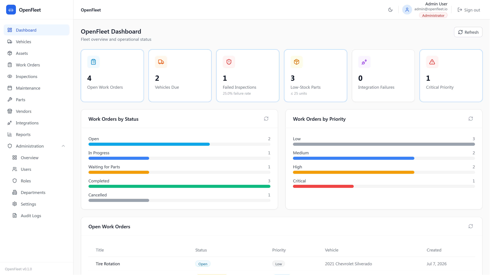

# OpenFleet


**A full-stack fleet and maintenance management system built with .NET 8 and React.**

OpenFleet is an open source application for managing vehicles, maintenance, inspections, work orders, inventory, vendors, reporting, and fleet operations. It combines a .NET 8 REST API with a React frontend and focuses on building a maintainable, well-tested business application using modern development practices.

## Live Demo

Try the hosted demo: [http://openfleet.mechanikadesign.com/](http://openfleet.mechanikadesign.com/)


| Email                                             | Password    | Role             |
| ------------------------------------------------- | ----------- | ---------------- |
| [viewer@openfleet.io](mailto:viewer@openfleet.io) | Viewer@1234 | Read-only Viewer |


The demo runs on Render’s free tier:

- **Cold start:** The API spins down after about 15 minutes of inactivity. The first request after idle can take around **30–60 seconds** to wake up.




More screenshots: [docs/screenshots.md](docs/screenshots.md)

---

## Why OpenFleet?

Fleet management is a good example of a business domain with connected workflows rather than isolated CRUD operations. A single inspection can generate a work order, update maintenance history, affect inventory, and appear in operational reports.

OpenFleet models those workflows while keeping the codebase approachable for developers who want to explore the architecture, learn from the implementation, or contribute.

---


## Features


### Backend


| Area                   | What's Included                                                                    |
| ---------------------- | ---------------------------------------------------------------------------------- |
| Fleet Management       | Vehicle and asset management with filtering, validation, and department assignment |
| Work Orders            | Complete lifecycle with status changes, priorities, labor tracking, and notes      |
| Inspections            | Inspection workflow with automatic work order creation                             |
| Preventive Maintenance | Mileage and time-based maintenance schedules                                       |
| Authentication         | JWT authentication with role-based authorization                                   |
| Audit Log              | Immutable audit history                                                            |
| Integrations           | Mock external integrations                                                         |
| Reporting              | Dashboard and operational reporting endpoints                                      |
| PDF export             | Work order detail and vehicle maintenance history via QuestPDF (Community license) |
| Observability          | Structured logging, health checks, correlation IDs                                 |
| Testing                | Unit, integration, and middleware tests                                            |
| CI                     | GitHub Actions                                                                     |


### Frontend


| Area           | What's Included                                 |
| -------------- | ----------------------------------------------- |
| Dashboard      | KPIs, charts, alerts, and operational summaries |
| Fleet          | Vehicle and asset management                    |
| Operations     | Work orders, inspections, maintenance, PDF export   |
| Inventory      | Parts and vendor management                     |
| Reports        | Operational reporting with filtering and export |
| Administration | Users, departments, settings, audit logs        |
| UX             | Responsive layout, dark mode, loading states    |
| Testing        | Vitest, MSW, Playwright                         |


---


## Core Workflows

Rather than focusing on individual CRUD screens, OpenFleet models the workflows found in fleet management software.

- Inspections can automatically create work orders.
- Preventive maintenance schedules track upcoming service based on mileage or time.
- Inventory updates as parts are consumed.
- Audit events capture important system activity.
- Reports combine data across multiple modules to provide operational visibility.

---


## Tech Stack


| Layer            | Technology                                |
| ---------------- | ----------------------------------------- |
| API              | .NET 8, ASP.NET Core, EF Core, PostgreSQL |
| PDF generation   | QuestPDF (Community license; see docs/architecture.md) |
| Frontend         | React, TypeScript, Vite                   |
| State Management | TanStack Query                            |
| Styling          | Tailwind CSS                              |
| Authentication   | JWT                                       |
| Testing          | xUnit, Vitest, Playwright                 |
| Containers       | Docker                                    |
| CI               | GitHub Actions                            |


---


## Architecture

OpenFleet consists of two independent applications.

- **OpenFleet.Api** exposes the REST API and contains the business logic.
- **OpenFleet.Web** provides the user interface and communicates with the API using JWT authentication.

The backend follows Clean Architecture to separate domain logic from infrastructure concerns. The frontend uses a feature-based organization that keeps related components, routes, and services together.

```text
React SPA
     │
 REST API
     │
Controllers
     │
Application
     │
Domain
     │
Infrastructure
     │
PostgreSQL
```

---


## Quick Start

Clone the repository.

```bash
git clone https://github.com/warrengalyen/OpenFleet.git
cd OpenFleet
```

Start the backend.

```bash
docker compose up --build
```

Start the frontend.

```bash
cd src/OpenFleet.Web
npm install
npm run dev
```

Open:

- Frontend: [http://localhost:5173](http://localhost:5173)
- Swagger: [http://localhost:8080/swagger](http://localhost:8080/swagger)

Default administrator account (local development):


| Email                                           | Password   |
| ----------------------------------------------- | ---------- |
| [admin@openfleet.io](mailto:admin@openfleet.io) | Admin@1234 |


For the hosted demo, use the Viewer account in [Live Demo](#live-demo) above.

---


## Documentation

The repository includes additional documentation for the application's architecture, workflows, and development.


| Document                           | Description                                   |
| ---------------------------------- | --------------------------------------------- |
| architecture.md                    | Backend architecture and project organization |
| api-design.md                      | REST API conventions and design decisions     |
| database-schema.md                 | Entity relationships and database structure   |
| frontend-architecture.md           | Frontend organization and patterns            |
| frontend-routes.md                 | Route definitions and authorization           |
| frontend-api-client.md             | API client implementation                     |
| frontend-accessibility.md          | Accessibility standards                       |
| inspection-maintenance-workflow.md | Inspection and maintenance lifecycle          |
| integration-flow.md                | External integration workflow                 |
| testing.md                         | Testing strategy                              |
| roadmap.md                         | Planned features                              |
|                                    |                                               |


---


## Roadmap

See [docs/roadmap.md](docs/roadmap.md).

---


## Project Layout

```text
src/
    OpenFleet.Api
    OpenFleet.Application
    OpenFleet.Domain
    OpenFleet.Infrastructure
    OpenFleet.Web

tests/
    OpenFleet.Tests

docs/
```

---


## Contributing

Contributions are welcome. Please read [CONTRIBUTING.md](CONTRIBUTING.md) before opening a pull request.

---


## License

Licensed under the MIT License.