# Screenshots

---

## Dashboard

### Dark mode

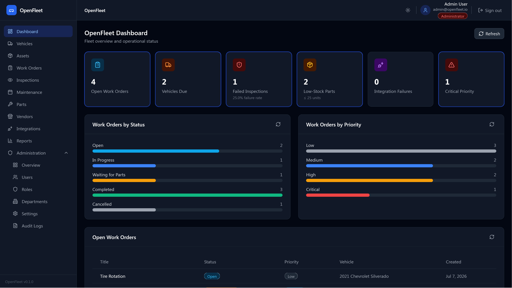

---

## Fleet

### Vehicles list

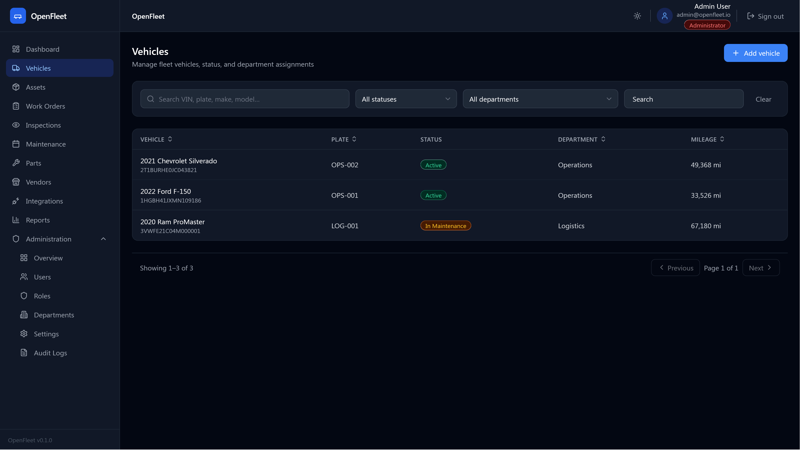

### Vehicle details

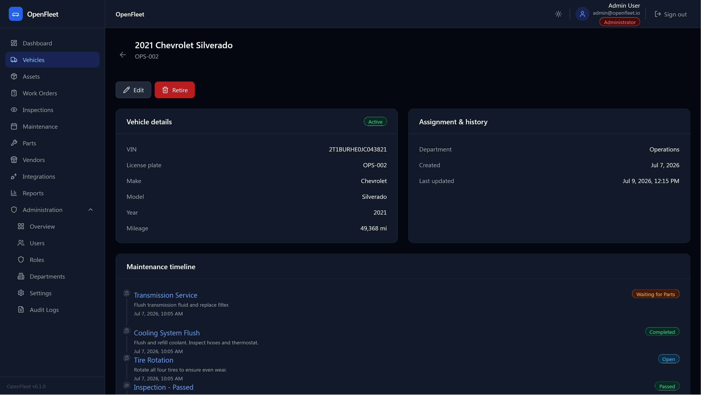

---

## Work Orders

### Work orders list

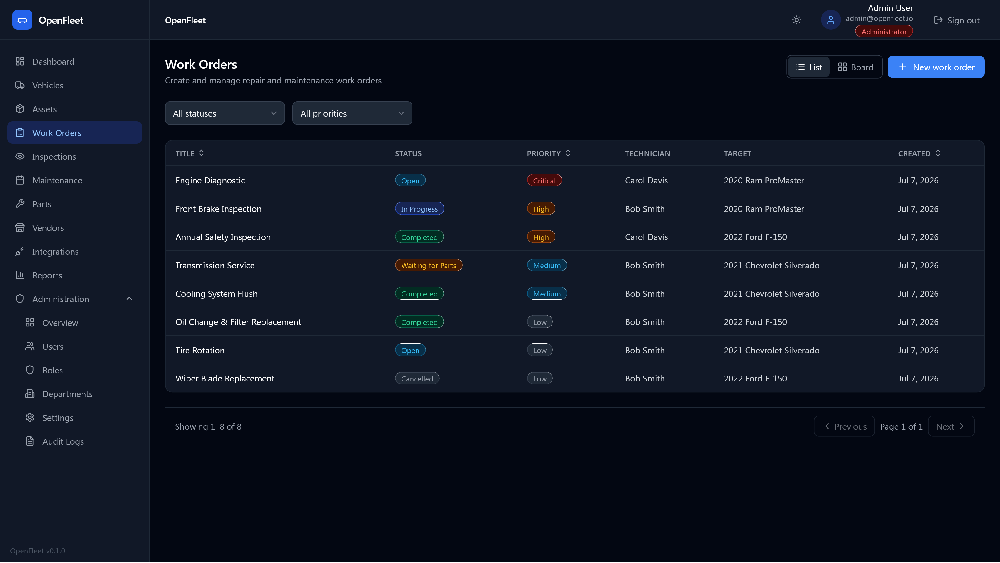

### Work order details

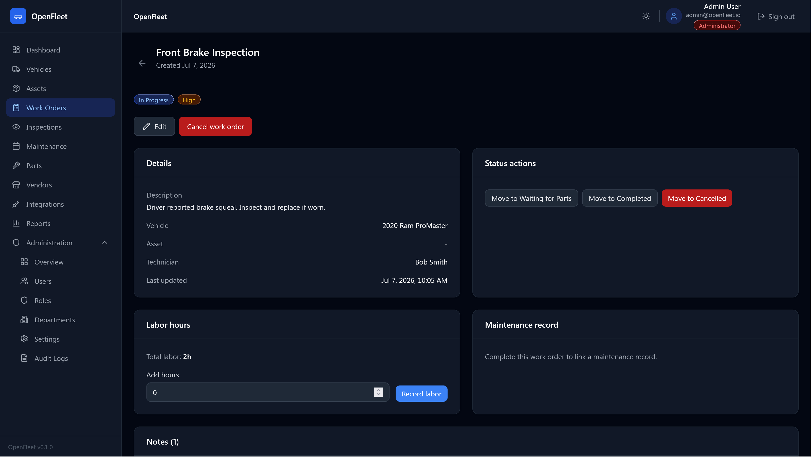

---

## Inspections

### Inspections list

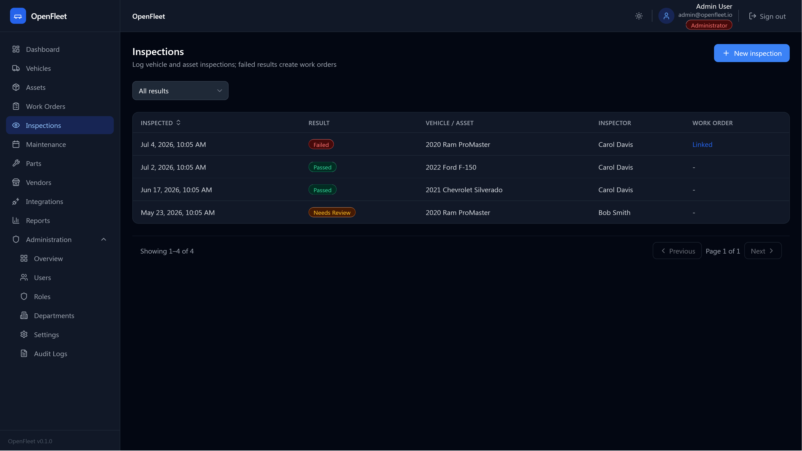

### Inspection details

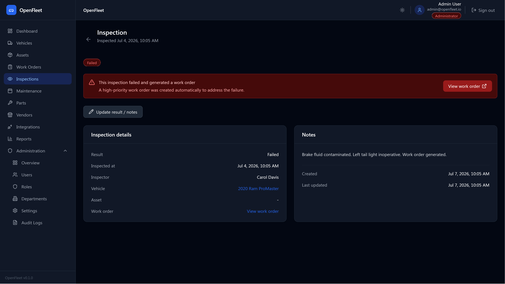

---

## Maintenance

### Maintenance schedules

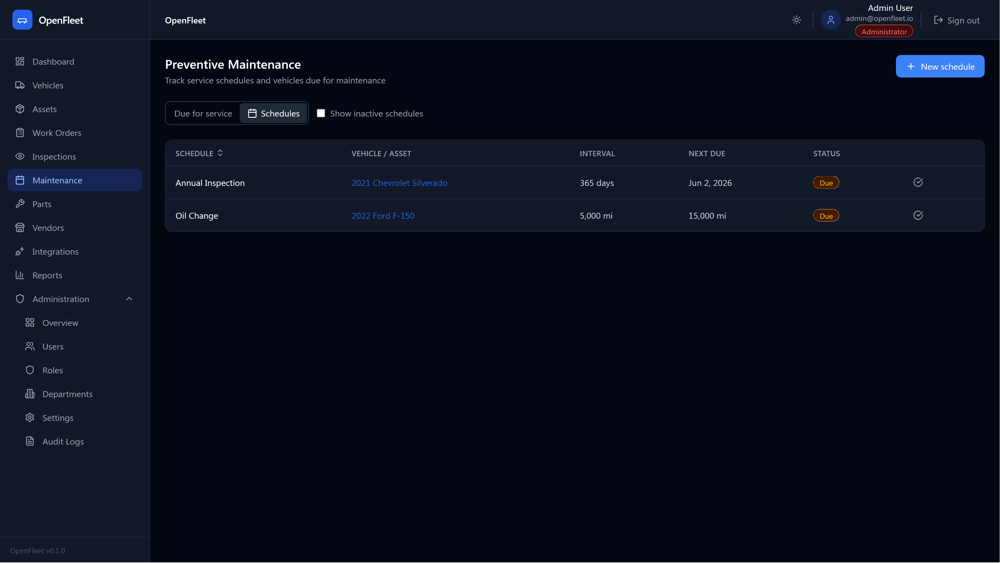

---

## Inventory & Vendors

### Inventory

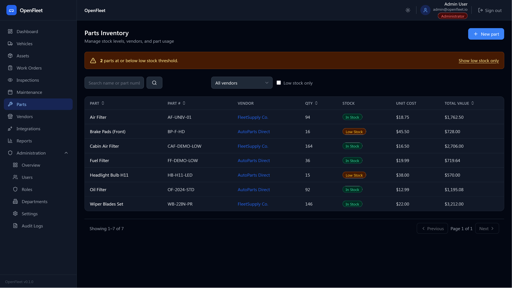

### Vendors

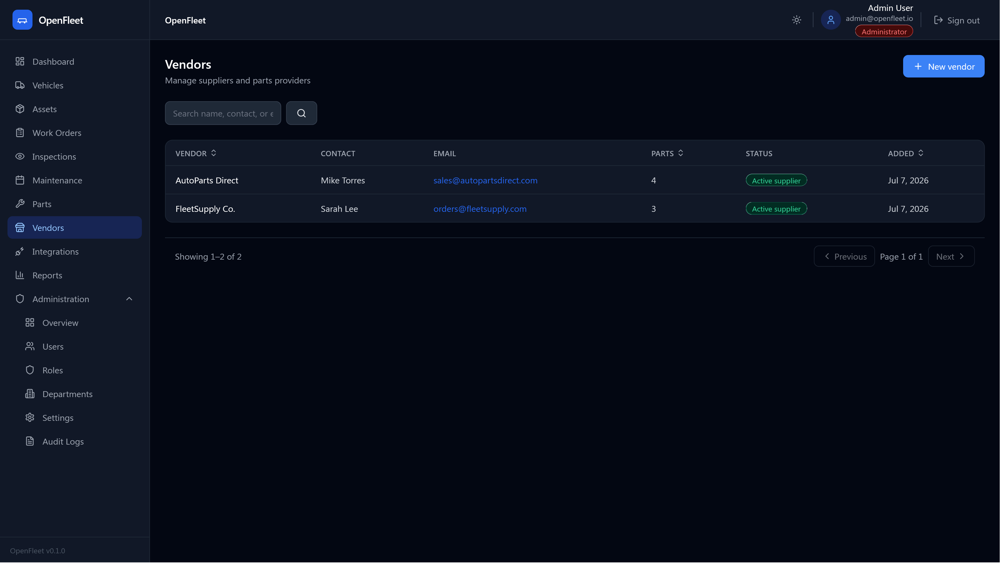

---

## Reports

### Reports dashboard

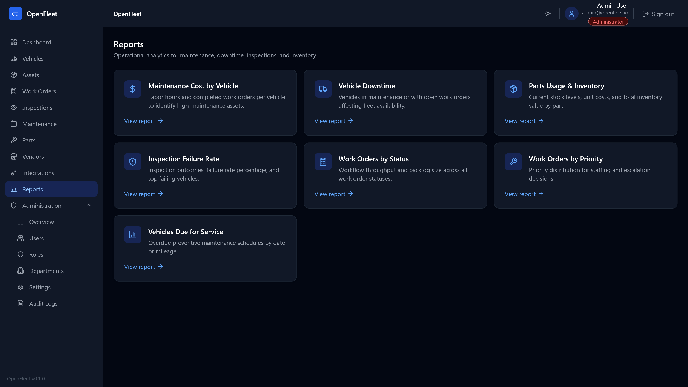

### Maintenance cost

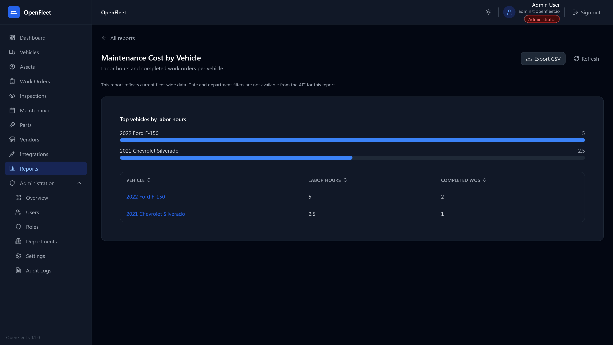

---

## Administration

### Users

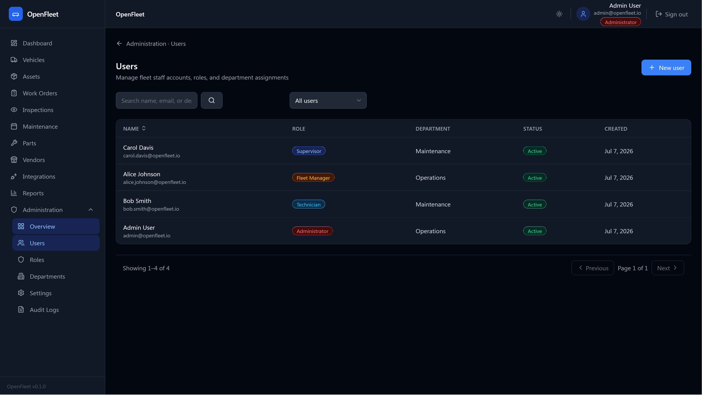

### Departments

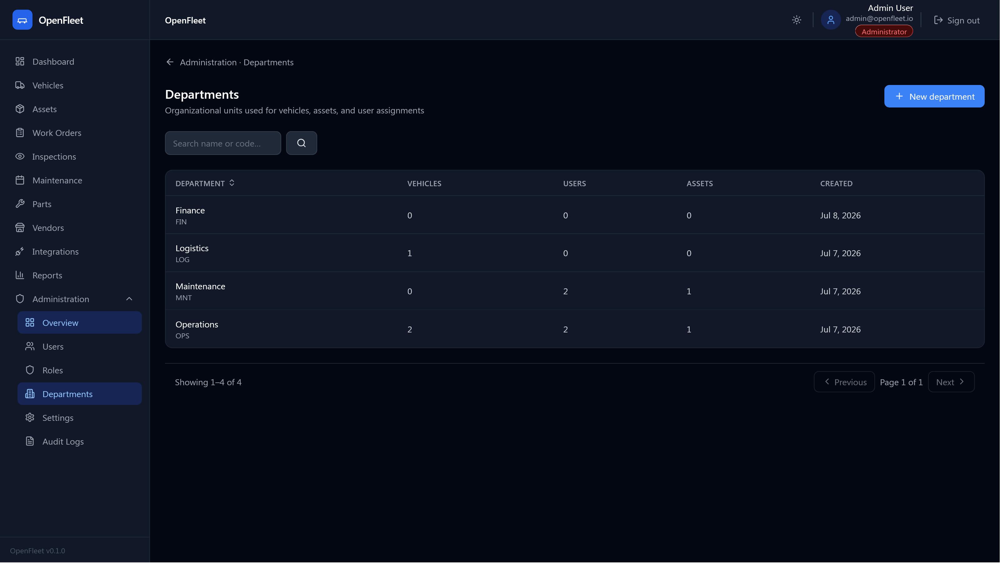

### Settings

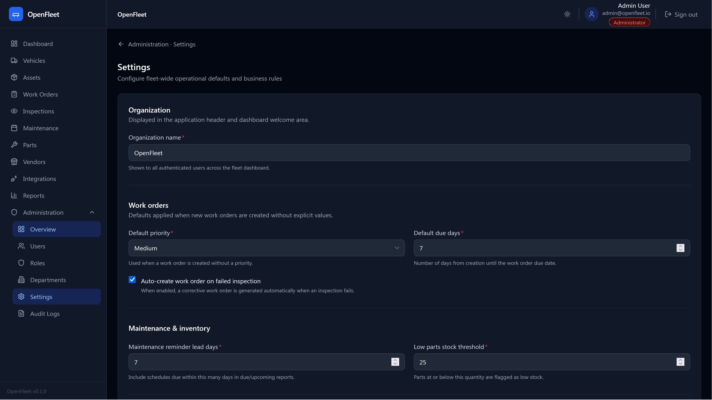

### Audit log

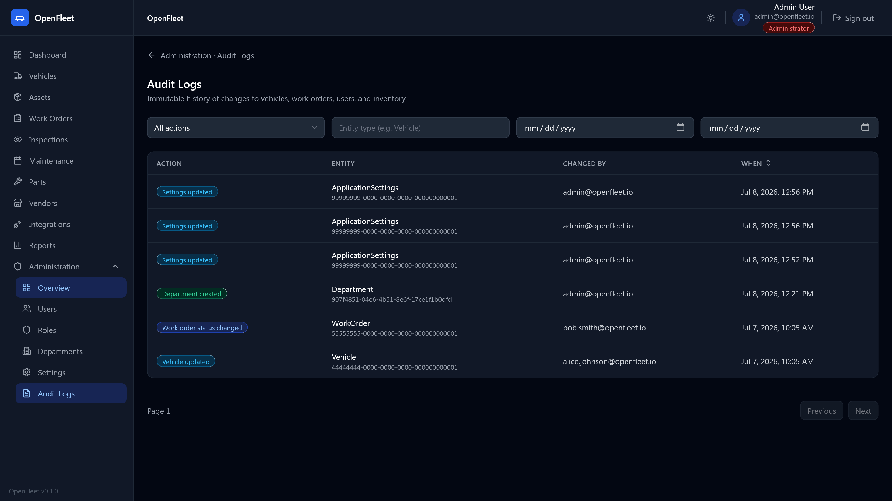
