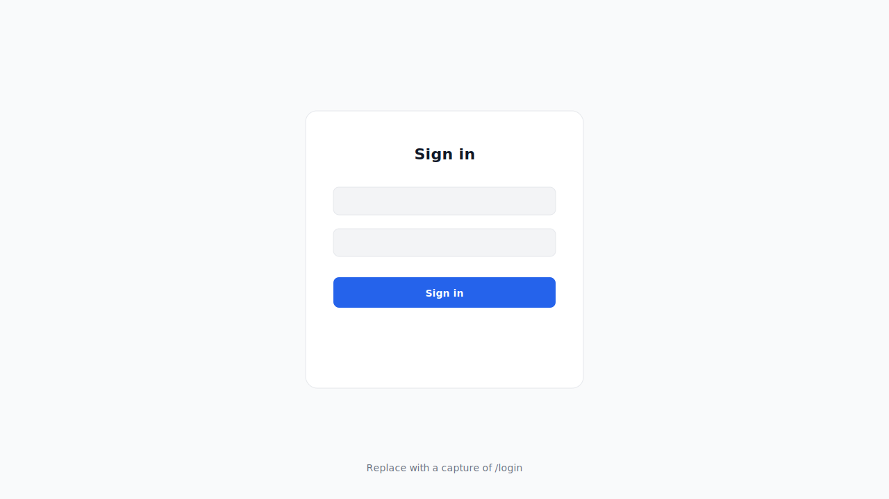
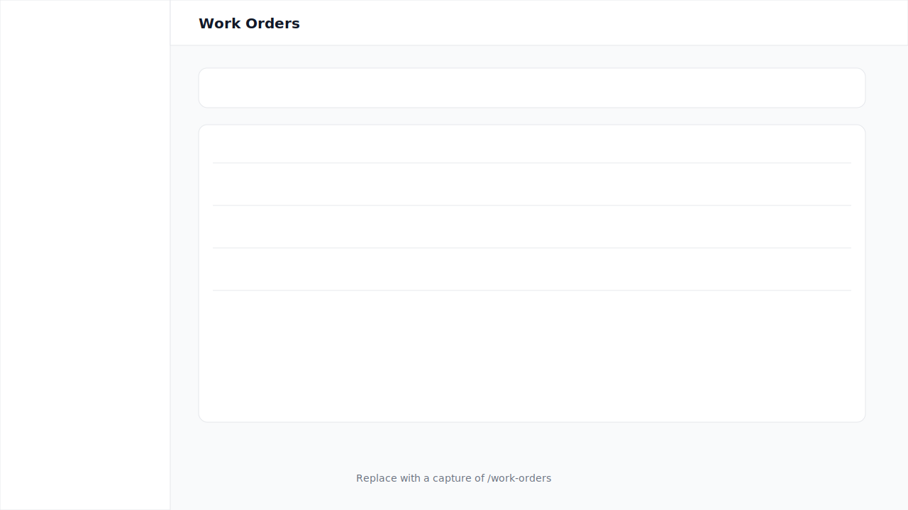
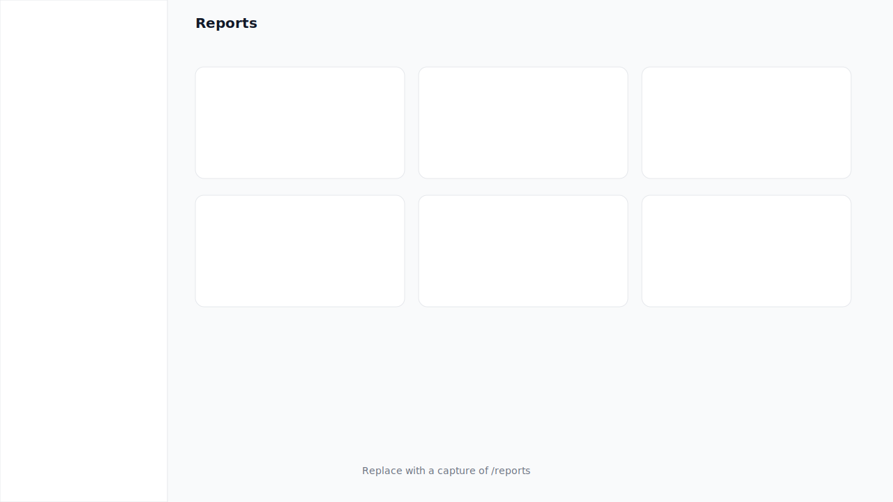

# Screenshots

OpenFleet includes both a **React web application** (fleet operations console) and a **Swagger UI** (API reference). This document describes how to capture UI screenshots for documentation and portfolio use.

---

## Web Application (OpenFleet.Web)

**URL (development):** `http://localhost:5173`

### Placeholder images

Wireframe placeholders are committed until real captures are added:

| Screen | Placeholder | Route |
|--------|-------------|-------|
| Login |  | `/login` |
| Dashboard |  | `/dashboard` |
| Work Orders |  | `/work-orders` |
| Reports |  | `/reports` |

### Capturing real screenshots

1. Start the API: `docker compose up --build` (or `dotnet run --project src/OpenFleet.Api`)
2. Start the frontend:
   ```bash
   cd src/OpenFleet.Web
   cp .env.example .env.local
   npm install
   npm run dev
   ```
3. Sign in as `admin@openfleet.io` / `Admin@1234`
4. Capture at **1280×720** or **1440×900** for consistency
5. Save PNG files to `docs/images/`:
   - `web-login.png`
   - `web-dashboard.png`
   - `web-work-orders.png`
   - `web-reports.png`
   - `web-vehicles.png`
   - `web-admin-users.png`
6. Replace placeholder references in this file and the root `README.md`

**Recommended captures for a portfolio:**

- Dashboard with stat cards and open work orders table populated
- Work order detail with status actions
- Reports index or a chart-heavy report detail page
- Admin users list (demonstrates RBAC UI)
- Mobile viewport (375px) of the sidebar drawer

---

## Swagger UI (API)

**URL (development):** `http://localhost:8080`

The Swagger UI provides interactive documentation for all API endpoints.

**To access:**

1. Start the API: `docker compose up --build`
2. Open `http://localhost:8080`
3. Authenticate: click **Authorize**, call `POST /api/auth/login`, paste the returned token

### Endpoint groups

| Tag | Endpoints |
|-----|-----------|
| Auth | Login, current user profile |
| Users | Admin user management |
| Vehicles | Fleet CRUD with filtering |
| Assets | Asset tracking CRUD |
| WorkOrders | Work order lifecycle management |
| Inspections | Inspection submission and history |
| MaintenanceSchedules | Schedule creation, due-for-service view |
| Departments | Department management |
| Integrations | Sync history and manual triggers |
| Audit | Audit trail history |
| Reports | 8 dashboard and operational report endpoints |

Save API screenshots as `docs/images/swagger-ui.png` and reference in the README if desired.

---

## Sample API Responses

### GET /api/reports/work-orders-by-status

```json
{
  "open": 2,
  "inProgress": 1,
  "waitingForParts": 1,
  "completed": 3,
  "cancelled": 1,
  "total": 8
}
```

### GET /health/ready

```json
{
  "status": "Healthy",
  "checks": [
    {
      "name": "postgres",
      "status": "Healthy",
      "description": null
    }
  ]
}
```

### POST /api/auth/login (response)

```json
{
  "token": "eyJhbGciOiJIUzI1NiIsInR5cCI6IkpXVCJ9...",
  "expiresAt": "2026-07-08T01:00:00Z",
  "userId": "22222222-0000-0000-0000-000000000004",
  "email": "admin@openfleet.io",
  "role": "Administrator",
  "fullName": "Admin User"
}
```

### GET /api/reports/inspection-failure-rate

```json
{
  "totalInspections": 4,
  "passed": 2,
  "failed": 1,
  "needsReview": 1,
  "failureRatePercent": 25.0,
  "topFailedVehicles": [
    {
      "vehicleId": "44444444-0000-0000-0000-000000000003",
      "vehicleLabel": "Ram ProMaster",
      "failedCount": 1
    }
  ]
}
```

### Error response (ProblemDetails)

```json
{
  "type": "https://httpstatuses.io/400",
  "title": "Domain Error",
  "status": 400,
  "detail": "Cannot transition from Completed to Open.",
  "instance": "/api/workorders/55555555-0000-0000-0000-000000000001/status",
  "correlationId": "908dcc06-a181-471c-8321-1977866db5cd"
}
```
